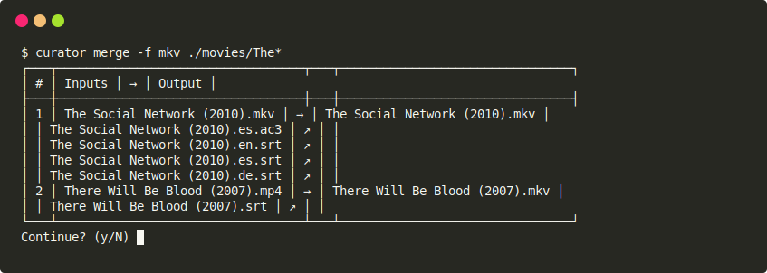
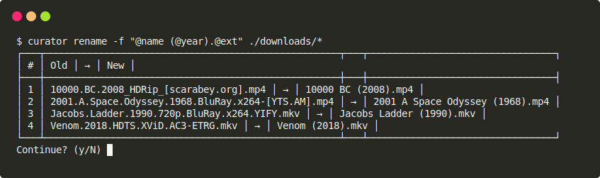
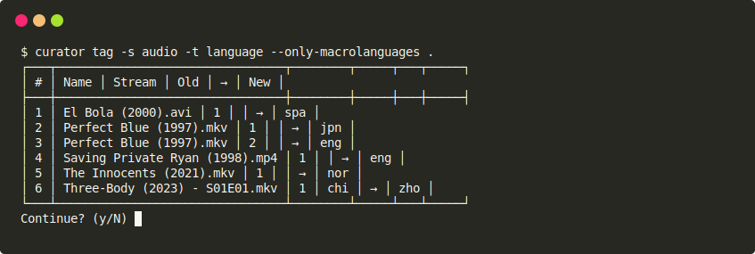

Curator
=======

[](https://github.com/AlexAltea/curator/actions/workflows/ci.yml)

Automated normalization and curating of media collections. Written in Python 3.x.

Curator is a collection of stateless CLI tools, following the [Unix philosophy](https://en.wikipedia.org/wiki/Unix_philosophy), to organize large collections of heterogeneous media. Each tool creates a *plan* made of *tasks* with clearly defined input and output files, which the user can optionally review before applying.

Install the package via:

```sh
pip install git+https://github.com/AlexAltea/curator.git
```

## Credits

Acknowledgements to people who contributed code/ideas to the project:

- [Victor Garcia Herrero](https://github.com/VictGH): Mathematician, Machine Learning expert and tamer of scoring functions.

## Features

Curator can automatically rename and link media files, edit container metadata, remux and merge streams. Reducing manual labor and achieve reliable results across different media from potentially different sources, some tools rely on signal processing and machine learning (e.g. [Whisper](https://openai.com/blog/whisper/), [LangID](https://github.com/saffsd/langid.py)).

Highlighted use cases (current and planned):

- [x] Filter media by container and stream metadata (all).
- [x] Rename files based on existing filenames ([`curator-rename`](#rename)).
- [x] Merge streams from multiple related containers ([`curator-merge`](#merge)).
- [x] Detect audio/subtitle language from sound and text data ([`curator-tag`](#tag)).
- [ ] Rename files based on existing metadata and databases ([`curator-rename`](#rename)).
- [ ] Synchronize audio/subtitle streams ([`curator-merge`](#merge) and [`curator-sync`](#sync)).
- [ ] Remove scene banners from subtitles ([`curator-clean`](#clean)).
- [ ] Detect watermarks in video streams ([`curator-clean`](#clean) and [`curator-merge`](#merge)).
- [ ] Select highest quality audio/video streams ([`curator-merge`](#merge)).

Below you can find a description and examples of all tools provided by Curator:

### Merge



### Rename

Update filenames according to a pattern made of the following variables:

| Key      | Description |
|----------|-------------|
| `@ext`   | File extension of the input media. |
| `@dbid`  | When using a database, the ID of the match, e.g. `imdbid-tt12345678`. |
| `@name`  | Localized name of the media. |
| `@oname` | Original name of the media (needs database). |
| `@tags`  | Tags present in the input media filename enclosed by square brackets, if any. |
| `@year`  | Year the media was released. |



### Sync

Synchronize streams via data cross-correlation.

Every synchronization task involves (A) a reference stream, and (B) the stream we want to synchronize. We name this relationship as *A ← B*. Curator can only handle the following types of synchronization tasks:

- [ ] *Video ← Audio*:\
    Comparing lip movement timestamps with ASR timestamps.
- [ ] *Audio ← Audio*:\
    Comparing sound data.
- [ ] *Audio ← Subtitle*:\
    Comparing ASR timestamps with uniquely matching text timestamps.
- [ ] *Subtitle ← Subtitle*:\
    Comparing text timestamps.

The synchronization plan (`SyncPlan`) will create a tree of synchronization tasks (`SyncTask`) for every media file it processes. For example, with an input `Media("movie.mkv")` with streams: `#0` (video), `#1` (audio:eng), `#2` (audio:spa), `#3` (subtitle:eng), `#4` (subtitle:spa), it will genarate the following sync proposals:

1. `#0` ← `#1`
2. `#1` ← `#2`
3. `#1` ← `#3`
4. `#3` ← `#4`

### Tag


